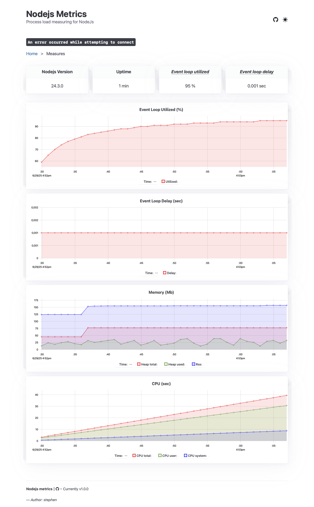

# node-metrics

[](https://badge.fury.io/js/%40stephen-shopopop%2Fnode-metrics)
[](https://opensource.org/licenses/ISC)
[](https://nodejs.org/)

> 🚀 Process load measuring plugin for Node.js with automatic "Service Unavailable" handling

A lightweight, production-ready middleware for monitoring Node.js application health and automatically handling server overload situations. Integrates seamlessly with popular frameworks (Koa, Express, Hono, Fastify) and provides Prometheus-compatible metrics.

## ✨ Features

- 🎯 **Automatic Overload Protection** - Returns HTTP 503 when system is under pressure
- 📊 **Real-time Metrics** - Monitor event loop delay, heap usage, RSS, and event loop utilization
- 🔌 **Framework Support** - Works with Koa, Express, Hono, Fastify, and vanilla Node.js
- 📈 **Prometheus Integration** - Built-in metrics endpoint and dashboard
- ⚡ **Low Overhead** - Uses `setTimeout` instead of `setInterval` to minimize system pressure
- 🎨 **Web Dashboard** - Beautiful UI to visualize metrics in real-time

## 📦 Installation

```shell
npm install @stephen-shopopop/node-metrics
```

## 🚀 Quick Start

### Koa

```js
const Koa = require('koa');
const { underPressureKoaMiddleware } = require('@stephen-shopopop/node-metrics');

const app = new Koa();

app.use(underPressureKoaMiddleware({
  appName: 'service-order',
  maxEventLoopDelay: 1000,
  maxHeapUsedBytes: 100000000,
  maxRssBytes: 100000000,
  maxEventLoopUtilization: 0.98,
  retryAfter: 10,
  webServerMetricsPort: 9090
}));

app.use(async ctx => {
  ctx.body = 'Hello World';
});

app.listen(3000);
```

### Express

```js
const express = require('express');
const { underPressureExpressMiddleware } = require('@stephen-shopopop/node-metrics');

const app = express();
const port = 3000;

app.use(underPressureExpressMiddleware({
  appName: 'service-order',
  maxEventLoopDelay: 1000,
  maxHeapUsedBytes: 100000000,
  maxRssBytes: 100000000,
  maxEventLoopUtilization: 0.98,
  retryAfter: 10,
  webServerMetricsPort: 9090
}));

app.get('/', (req, res) => {
  res.send('Hello World!');
});

app.listen(port, () => {
  console.log(`Example app listening on port ${port}`);
});
```

### Hono

```js
import { Hono } from 'hono';
import { underPressureHonoMiddleware } from '@stephen-shopopop/node-metrics';

const app = new Hono();

app.use('*', underPressureHonoMiddleware({
  appName: 'service-order',
  maxEventLoopDelay: 1000,
  maxHeapUsedBytes: 100000000,
  maxRssBytes: 100000000,
  maxEventLoopUtilization: 0.98,
  retryAfter: 10,
  webServerMetricsPort: 9090
}));

app.get('/', (c) => c.text('Hello Hono!'));

export default app;
```

### Fastify

```js
import Fastify from 'fastify';
import { underPressureFastifyPlugin } from '@stephen-shopopop/node-metrics';

const fastify = Fastify();

fastify.register(underPressureFastifyPlugin({
  appName: 'service-order',
  maxEventLoopDelay: 1000,
  maxHeapUsedBytes: 100000000,
  maxRssBytes: 100000000,
  maxEventLoopUtilization: 0.98,
  retryAfter: 10,
  webServerMetricsPort: 9090
}));

fastify.get('/', async (request, reply) => {
  return { hello: 'world' };
});

fastify.listen({ port: 3000 });
```

### Manual Integration (Vanilla Node.js)

```js
import { createServer } from 'node:http';
import { Metrics, isUnderPressure } from '@stephen-shopopop/node-metrics';

const metrics = Metrics.start({
  appName: 'service-order',
  sampleIntervalInMs: 1000,
  resolution: 10,
  webServerMetricsPort: 9090
});

const options = {
  maxEventLoopDelay: 1000,
  maxHeapUsedBytes: 100000000,
  maxRssBytes: 100000000,
  maxEventLoopUtilization: 0.98
};

const hostname = '127.0.0.1';
const port = 3000;

const server = createServer((req, res) => {
  if (isUnderPressure({ ...options, ...metrics.measures() })) {
    res.statusCode = 503;
    res.setHeader('Retry-After', '10');
    res.end('Service Unavailable');
    return;
  }

  res.statusCode = 200;
  res.setHeader('Content-Type', 'text/plain');
  res.end('Hello World');
});

server.listen(port, hostname, () => {
  console.log(`Server running at http://${hostname}:${port}/`);
});
```

### Standalone Metrics Setup

You can set up metrics separately and preload them when starting your application:

```ts
// file: metrics.js
import { Metrics } from '@stephen-shopopop/node-metrics';

const metrics = Metrics.start({
  webServerMetricsPort: 9090,
  appName: 'service-test'
});

process.on('SIGTERM', () => {
  metrics
    .closeWebServerMetrics()
    .then(() => console.log('Metrics terminated'))
    .catch((error) => console.error('Error terminating metrics', error))
    .finally(() => process.exit(0));
});
```

**Run your application with metrics preloaded:**

```shell
node -r ./metrics.js app.js
```

## ⚙️ Configuration Options

| Option | Type | Default | Description |
|--------|------|---------|-------------|
| `appName` | `string` | - | **Required**. Application name (format: `service-name`) |
| `sampleIntervalInMs` | `number` | `1000` | Interval in milliseconds for metrics collection |
| `resolution` | `number` | `10` | Resolution/granularity of collected metrics |
| `webServerMetricsPort` | `number` | - | Port for Prometheus metrics server (recommended: `9090`) |
| `maxEventLoopDelay` | `number` | - | Maximum allowed event loop delay (ms) |
| `maxEventLoopUtilization` | `number` | - | Maximum event loop utilization (0-1, e.g., `0.98` = 98%) |
| `maxHeapUsedBytes` | `number` | - | Maximum heap memory usage in bytes |
| `maxRssBytes` | `number` | - | Maximum Resident Set Size in bytes |
| `retryAfter` | `number` | - | Seconds to wait before retrying (sent in `Retry-After` header) |

### Example Configuration

```js
{
  appName: 'service-order',
  sampleIntervalInMs: 1000,        // Collect metrics every second
  resolution: 10,                   // Keep last 10 samples
  maxEventLoopDelay: 1000,         // Alert if event loop delay > 1000ms
  maxEventLoopUtilization: 0.98,   // Alert if event loop > 98% utilized
  maxHeapUsedBytes: 100000000,     // Alert if heap > 100MB
  maxRssBytes: 100000000,          // Alert if RSS > 100MB
  retryAfter: 10,                  // Tell clients to retry after 10s
  webServerMetricsPort: 9090       // Serve metrics on port 9090
}
```

## 📊 Monitoring & Metrics

### Dashboard UI

Access the beautiful real-time dashboard at:

```
http://127.0.0.1:9090
```



### Prometheus Metrics Endpoint

Metrics are exposed in Prometheus format at:

```
http://127.0.0.1:9090/metrics
```

**Available Metrics:**

```txt
# HELP nodejs_event_loop_delay_milliseconds The mean of the recorded event loop delays
# TYPE nodejs_event_loop_delay_milliseconds gauge
nodejs_event_loop_delay_milliseconds{service="service-order"} 0.9878575824175826

# HELP nodejs_event_loop_utilized The percentage of event loop utilization
# TYPE nodejs_event_loop_utilized gauge
nodejs_event_loop_utilized{service="service-order"} 0.10445105761836926

# HELP nodejs_heap_used_bytes The amount of memory used by the V8 heap
# TYPE nodejs_heap_used_bytes gauge
nodejs_heap_used_bytes{service="service-order"} 32637488

# HELP nodejs_heap_total_bytes The total size of the V8 heap
# TYPE nodejs_heap_total_bytes gauge
nodejs_heap_total_bytes{service="service-order"} 34684928

# HELP nodejs_rss_bytes The resident set size, or total memory allocated for the process
# TYPE nodejs_rss_bytes gauge
nodejs_rss_bytes{service="service-order"} 179077120

# HELP nodejs_process_start_time_seconds The process start time, represented in seconds since the Unix epoch
# TYPE nodejs_process_start_time_seconds gauge
nodejs_process_start_time_seconds{service="service-order"} 1750345329

# HELP nodejs_process_cpu_user_seconds_total The total user CPU time consumed by the process, in seconds
# TYPE nodejs_process_cpu_user_seconds_total counter
nodejs_process_cpu_user_seconds_total{service="service-order"} 1.494779

# HELP nodejs_process_cpu_system_seconds_total The total system CPU time consumed by the process, in seconds
# TYPE nodejs_process_cpu_system_seconds_total counter
nodejs_process_cpu_system_seconds_total{service="service-order"} 0.120983

# HELP nodejs_process_cpu_seconds_total The total CPU time (user + system) consumed by the process, in seconds
# TYPE nodejs_process_cpu_seconds_total counter
nodejs_process_cpu_seconds_total{service="service-order"} 1.615762

# HELP nodejs_active_handles Number of active libuv handles grouped by handle type
# TYPE nodejs_active_handles gauge
nodejs_active_handles{service="service-order",type="WriteStream"} 2
nodejs_active_handles{service="service-order",type="ReadStream"} 1
nodejs_active_handles{service="service-order",type="Server"} 1
nodejs_active_handles{service="service-order",type="Socket"} 1
```

## 🔍 How It Works

### setTimeout vs setInterval

Under the hood, `node-metrics` uses `setTimeout` to perform polling checks instead of `setInterval`. This design choice is intentional to avoid adding additional pressure to an already stressed system.

**Why setTimeout?**

- **`setInterval`** calls repeatedly at scheduled intervals regardless of whether the previous call completed, potentially piling up calls when the server is under load
- **`setTimeout`** is called only once and reschedules itself after completion, preventing call accumulation
- This ensures the monitoring itself doesn't contribute to system overload

**Note:** The two methods are not identical in behavior. The timer function is not guaranteed to run at the exact same rate when the system is under pressure or running long processes, but this trade-off is acceptable for health monitoring purposes.

### Architecture Flow

```
┌─────────────────────────────────────────────────────────────────────────┐
│                          APPLICATION LAYER                              │
│  ┌──────────────┐  ┌──────────────┐  ┌──────────────┐  ┌──────────────┐ │
│  │     Koa      │  │   Express    │  │     Hono     │  │   Fastify    │ │
│  │  Application │  │  Application │  │  Application │  │  Application │ │
│  └──────┬───────┘  └──────┬───────┘  └──────┬───────┘  └──────┬───────┘ │
│         │                 │                 │                 │         │
│         └─────────────────┴─────────────────┴─────────────────┘         │
│                                     │                                   │
│                      ┌──────────────▼──────────────┐                    │
│                      │   Middleware Integration    │                    │
│                      │  underPressure*Middleware() │                    │
│                      └──────────────┬──────────────┘                    │
└─────────────────────────────────────┼──────────────────────────────────┘
                              │
┌─────────────────────────────▼──────────────────────────────────────────┐
│                           CORE LAYER                                   │
│                                                                        │
│  ┌──────────────────────────────────────────────────────────┐          │
│  │              Metrics (Singleton)                         │          │
│  │  ┌────────────────────────────────────────────────────┐  │          │
│  │  │  start()  │  register()  │  measures()  │ destroy()│  │          │
│  │  └────────────────────────────────────────────────────┘  │          │
│  │                                                          │          │
│  │  ┌─────────────┐      ┌──────────────┐                   │          │
│  │  │   Timer     │──────▶│   Mediator   │                  │          │
│  │  │(setTimeout) │      │  (Plugins)   │                   │          │
│  │  └─────────────┘      └──────┬───────┘                   │          │
│  │                              │                           │          │
│  │  ┌───────────────────────────▼────────────────────────┐  │          │
│  │  │            StoreBuilder (Metrics Storage)          │  │          │
│  │  └───────────────────────────┬────────────────────────┘  │          │
│  │                              │                           │          │
│  │  ┌───────────────────────────▼────────────────────────┐  │          │
│  │  │         BroadcastChannel (Pub/Sub)                 │  │          │
│  │  └────────────────────────────────────────────────────┘  │          │
│  └──────────────────────────────────────────────────────────┘          │
│                              │                                         │
│  ┌───────────────────────────▼──────────────────────────────────────┐  │
│  │                    Metrics Server                                │  │
│  │  ┌──────────────┐  ┌──────────────┐  ┌──────────────────────┐    │  │
│  │  │  GET /       │  │ GET /metrics │  │ GET /metrics-stream  │    │  │
│  │  │  Dashboard   │  │  Prometheus  │  │    SSE Stream        │    │  │
│  │  └──────────────┘  └──────────────┘  └──────────────────────┘    │  │
│  └──────────────────────────────────────────────────────────────────┘  │
└────────────────────────────────────────────────────────────────────────┘
                              │
┌─────────────────────────────▼──────────────────────────────────────────┐
│                         PLUGIN LAYER                                   │
│  ┌──────────────┐  ┌──────────────┐  ┌──────────────────────────┐      │
│  │   Memory     │  │  Event Loop  │  │   Event Loop             │      │
│  │   Usage      │  │    Delay     │  │   Utilization            │      │
│  └──────────────┘  └──────────────┘  └──────────────────────────┘      │
│  ┌──────────────┐  ┌──────────────┐  ┌──────────────────────────┐      │
│  │  Process CPU │  │   Process    │  │   Active Handles/        │      │
│  │    Usage     │  │   Uptime     │  │   Resources              │      │
│  └──────────────┘  └──────────────┘  └──────────────────────────┘      │
└────────────────────────────────────────────────────────────────────────┘


📊 Request Flow with Pressure Detection:

  ┌─────────────┐
  │  HTTP       │
  │  Request    │
  └──────┬──────┘
         │
         ▼
  ┌──────────────────┐
  │   Middleware     │
  │   Check          │
  └──────┬───────────┘
         │
         ▼
  ┌──────────────────┐
  │  measures()      │
  │  Get current     │
  │  metrics         │
  └──────┬───────────┘
         │
         ▼
  ┌──────────────────────────────┐
  │  isUnderPressure()           │
  │  ┌────────────────────────┐  │
  │  │ Event Loop Delay > max?│  │
  │  │ Heap Usage > max?      │  │
  │  │ RSS Memory > max?      │  │
  │  │ EL Utilization > max?  │  │
  │  └────────────────────────┘  │
  └──────┬─────────────┬─────────┘
         │             │
    Yes  │             │  No
         ▼             ▼
  ┌─────────────┐  ┌──────────────┐
  │  Return 503 │  │  Continue to │
  │  Service    │  │  next()      │
  │  Unavailable│  │              │
  │  Retry-After│  │              │
  └─────────────┘  └──────────────┘


⏱️  Periodic Metrics Collection (Every sampleIntervalInMs):

  ┌──────────────┐
  │  setTimeout  │
  │  Trigger     │
  └──────┬───────┘
         │
         ▼
  ┌──────────────────┐
  │  Mediator        │
  │  Iterate Plugins │
  └──────┬───────────┘
         │
         ▼
  ┌──────────────────────────────────────────┐
  │  Each Plugin.capture(StoreBuilder)       │
  │  ┌────────────────────────────────────┐  │
  │  │ MemoryUsagePlugin                  │  │
  │  │   → heap_used_bytes                │  │
  │  │   → rss_bytes                      │  │
  │  ├────────────────────────────────────┤  │
  │  │ EventLoopDelayPlugin               │  │
  │  │   → event_loop_delay_milliseconds  │  │
  │  ├────────────────────────────────────┤  │
  │  │ EventLoopUtilizationPlugin         │  │
  │  │   → event_loop_utilized            │  │
  │  ├────────────────────────────────────┤  │
  │  │ ProcessCpuUsagePlugin              │  │
  │  │   → process_cpu_*_seconds_total    │  │
  │  └────────────────────────────────────┘  │
  └──────┬───────────────────────────────────┘
         │
         ▼
  ┌──────────────────┐
  │  StoreBuilder    │
  │  Update Metrics  │
  └──────┬───────────┘
         │
         ▼
  ┌──────────────────┐
  │ BroadcastChannel │
  │ Publish Update   │
  └──────────────────┘
         │
         ▼
  ┌──────────────────────────────┐
  │  Subscribers (Dashboard,     │
  │  Metrics Stream, etc.)       │
  └──────────────────────────────┘
```

## 📚 Documentation

For detailed API documentation and advanced usage:

- [**Full Documentation**](https://stephen-shopopop.github.io/node-metrics/)

## 🤝 Contributing

Contributions are welcome! Please feel free to submit a Pull Request.

## 📝 License

[ISC](LICENSE) © [Stephen Deletang](https://github.com/stephen-shopopop)

## 🔗 Links

- [GitHub Repository](https://github.com/stephen-shopopop/node-metrics)
- [npm Package](https://www.npmjs.com/package/@stephen-shopopop/node-metrics)
- [Issue Tracker](https://github.com/stephen-shopopop/node-metrics/issues)
- [Documentation](https://stephen-shopopop.github.io/node-metrics/)

---

Made with ❤️ by [Stephen Deletang](https://github.com/stephen-shopopop)
